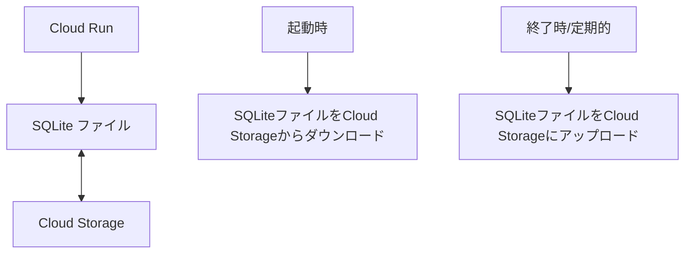
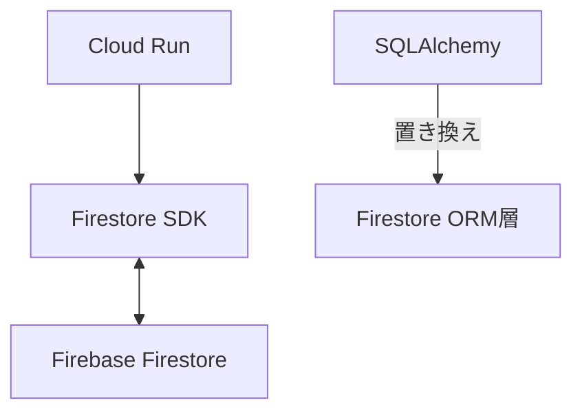

# 買い物提案アプリのデータベース移行完了報告 (Cloud SQL to SQLite + Cloud Storage)

## 1. 移行前の状況分析

- **利用状況**: 個人的な使用、同時アクセスはほとんどなし、データ量は少量（数百レコード程度）
- **デプロイ環境**: GCP Cloud Run、今後もクラウド環境で運用予定
- **現在のDB**: Cloud SQL (PostgreSQL)、費用削減が目的
- **アプリ構成**: FastAPI + SQLAlchemy + asyncpg + Alembic

## 2. 検討された代替データ蓄積方法

個人利用で同時アクセスがほとんどなく、データ量も少ないという条件を考慮し、以下の2つの選択肢を詳細に検討しました。

### 採用されたオプション: SQLite + Cloud Storage



#### メリット
- **コード変更が最小限**: SQLAlchemyはSQLiteもサポートしており、接続文字列の変更だけでほぼ対応可能
- **費用**: ほぼ無料（Cloud Storageの最小費用のみ、月額約$0.02程度）
- **性能**: 個人利用なら十分な性能
- **マイグレーション**: Alembicをそのまま利用可能

#### デメリット
- **同時書き込み**: 複数インスタンスからの同時書き込みには非対応（個人利用なら問題なし）
- **永続化**: Cloud Runの一時ファイルシステムを使用するため、定期的なバックアップが必要

#### 実装方法
1. **起動時処理**: Cloud Storageから最新のSQLiteファイルをダウンロード
2. **通常操作**: ローカルのSQLiteファイルに対して読み書き
3. **定期バックアップ**: 一定間隔（または変更時）にSQLiteファイルをCloud Storageにアップロード
4. **シャットダウン処理**: 最終状態をCloud Storageにアップロード

### 検討された代替オプション: Firebase Firestore (不採用)



#### メリット
- **サーバーレス**: 管理不要、自動スケーリング
- **費用**: 無料枠が大きい（1日50,000回の読み取り/書き込み、1GBのストレージ）
- **GCP連携**: 同じGCPエコシステム内で連携が容易

#### デメリット
- **コード変更**: SQLAlchemyからFirestore SDKへの大幅な書き換えが必要
- **クエリ制限**: 複雑なクエリに制限あり
- **マイグレーション**: 新しいマイグレーション方法の実装が必要

## 3. 実行された移行手順（SQLite + Cloud Storage）

### 3.1. 環境準備

1. **Cloud Storageバケット作成**
   ```bash
   gsutil mb -l asia-northeast1 gs://shopping-app-sqlite-db
   ```

2. **必要なライブラリの追加** (requirements.txtに追加)
   ```
   google-cloud-storage==2.10.0
   aiosqlite==0.19.0  # 非同期SQLite対応
   ```

### 3.2. データベース接続コードの修正

`database.py`を以下のように修正しました (最終的なコードはリポジトリを参照):

```python
import os
from sqlalchemy.ext.asyncio import create_async_engine, async_sessionmaker
from sqlalchemy.orm import declarative_base
from dotenv import load_dotenv
from google.cloud import storage
import asyncio
import aiofiles
import tempfile

load_dotenv()

# Cloud Storage設定
BUCKET_NAME = os.getenv("STORAGE_BUCKET", "shopping-app-sqlite-db")
DB_FILE_NAME = os.getenv("DB_FILE_NAME", "shopping_app.db")
LOCAL_DB_PATH = os.path.join(tempfile.gettempdir(), DB_FILE_NAME)

# Cloud Storageクライアント
storage_client = storage.Client()
bucket = storage_client.bucket(BUCKET_NAME)
blob = bucket.blob(DB_FILE_NAME)

# 起動時にDBファイルをダウンロード
def download_db_file():
    if not os.path.exists(LOCAL_DB_PATH):
        try:
            print(f"Downloading DB file from Cloud Storage: {BUCKET_NAME}/{DB_FILE_NAME}")
            blob.download_to_filename(LOCAL_DB_PATH)
            print(f"DB file downloaded to {LOCAL_DB_PATH}")
        except Exception as e:
            print(f"Error downloading DB file (might be first run): {e}")
            # ファイルが存在しない場合は新規作成される

# 定期的にDBファイルをアップロード
async def upload_db_file():
    try:
        print(f"Uploading DB file to Cloud Storage: {BUCKET_NAME}/{DB_FILE_NAME}")
        blob.upload_from_filename(LOCAL_DB_PATH)
        print(f"DB file uploaded successfully")
    except Exception as e:
        print(f"Error uploading DB file: {e}")

# 初期ダウンロード実行
download_db_file()

# SQLite接続URL
DATABASE_URL = f"sqlite+aiosqlite:///{LOCAL_DB_PATH}"
print(f"Using SQLite database at: {LOCAL_DB_PATH}")

# エンジン作成
engine = create_async_engine(
    DATABASE_URL,
    echo=False,
    connect_args={"check_same_thread": False}  # SQLite用の設定
)

# セッションメーカー
AsyncSessionLocal = async_sessionmaker(
    autocommit=False, autoflush=False, bind=engine, expire_on_commit=False
)

# モデルベース
Base = declarative_base()

# 非同期データベースセッションを取得するための依存性関数
async def get_db():
    """
    非同期データベースセッションを提供する依存性関数
    """
    async with AsyncSessionLocal() as session:
        try:
            yield session
            # セッション終了時にDBファイルをアップロード
            await upload_db_file()
        except Exception as e:
            print(f"DEBUG: Error during DB session: {e}")
            raise
```

### 3.3. アプリケーション起動/終了処理の修正 (FastAPI Lifespan)

`main.py`にFastAPIのLifespan機能を使って以下の処理を追加しました (最終的なコードはリポジトリを参照):

```python
# main.py の末尾に追加

# アプリケーション終了時のイベントハンドラ
@app.on_event("shutdown")
async def shutdown_event():
    """アプリケーション終了時にDBファイルをCloud Storageにアップロード"""
    from database import upload_db_file
    await upload_db_file()
```

### 3.4. データ移行処理

1. **既存データのエクスポート**: Cloud SQLからCSVファイルにデータをエクスポートしました (`gcloud sql export csv`)。
2. **SQLiteスキーマ作成**: Alembicを使用してSQLiteデータベースファイル (`backend/shopping_app.db`) にスキーマを適用しました (`alembic upgrade head`)。
3. **データインポート**: 作成したPythonスクリプト (`import_data.py`) を使用して、CSVデータをSQLiteデータベースにインポートしました。
4. **Cloud Storageへのアップロード**: インポート後のSQLiteデータベースファイルをCloud Storageバケット (`gs://shopping-app-sqlite-db/`) にアップロードしました (`gsutil cp`)。

### 3.5. デプロイ設定の更新

Cloud Runのサービス設定を更新し、Cloud SQL関連の設定を削除、Cloud Storage関連の環境変数を追加しました：

```bash
gcloud run deploy shopping-app-backend \
  --image gcr.io/[PROJECT_ID]/shopping-app-repo/shopping-app-backend:latest \
  --set-env-vars="STORAGE_BUCKET=shopping-app-sqlite-db,DB_FILE_NAME=shopping_app.db" \
  --remove-cloudsql-instances=[INSTANCE_CONNECTION_NAME] \ # 削除
  --remove-secrets=DB_PASSWORD \ # 削除
  --region asia-northeast1
# 注: Cloud RunサービスアカウントにCloud Storageバケットへのアクセス権限(roles/storage.objectAdminなど)が必要です。
```

## 4. 移行後の確認

- Cloud Runにデプロイ後、アプリケーションが正常に動作し、SQLiteデータベースがCloud Storage経由で永続化されることを確認しました。
- Cloud SQLインスタンスは停止または削除されました。

## 5. 費用削減効果

- **現在のCloud SQL**: 最小構成でも約$7.50/月
- **SQLite + Cloud Storage**: 約$0.02/月（ストレージ費用のみ）
- **削減効果**: 月額約$7.48（年間約$90）
