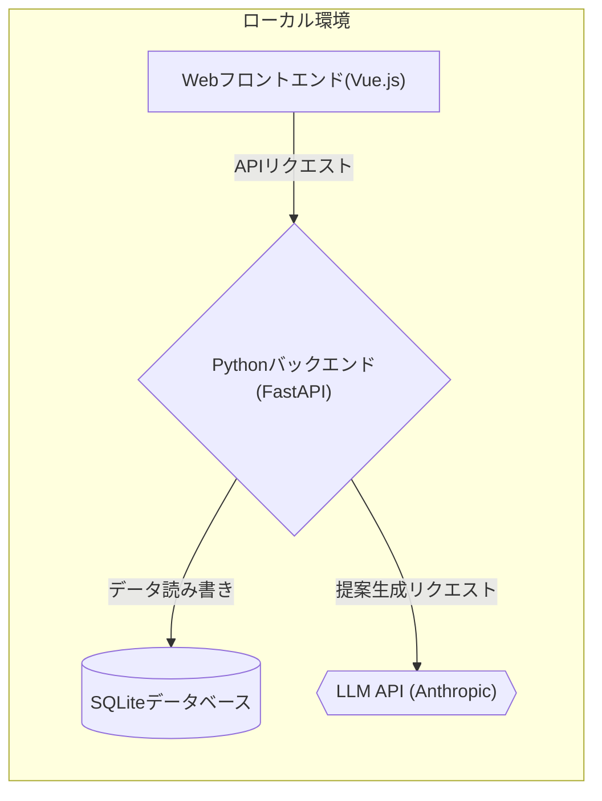

# 買い物提案アプリのアーキテクチャ設計

## プロジェクト概要

家族向けの買い物提案アプリを開発します。このアプリは以下の機能を提供します：

- LLMを使って、スーパーやコンビニで購入すべき品物をAIがユーザーに提案
- ユーザーは、実際に購入した品物を登録できる（AIに提案されたものかどうかは問わない）
- AIは、次回の品物提案時に、上記で登録された品物の蓄積データを参照する
- いつも買われる定番商品だけでなく、たまに買われる商品や、ほとんど買わない商品も提案に織り交ぜる
- 季節情報を考慮した提案を行う（例：夏はアイス、冬は鍋の素など）

## 1. 全体アーキテクチャ

### テキスト記述

```
【ローカル環境（初期フェーズ）】
Webフロントエンド → Pythonバックエンド → SQLiteデータベース + LLM API

【クラウド環境（将来フェーズ）】
Webフロントエンド → Pythonバックエンド → PostgreSQLデータベース + LLM API
```

### Mermaid図 (ローカル環境)



## 2. 技術スタック

### バックエンド

- **言語**: Python
- **フレームワーク**: FastAPI（高速、型ヒント対応、自動ドキュメント生成）
- **コンテナ化**: Docker
- **データベース**:
  - 初期: SQLite（シンプル、ファイルベース）
  - 将来: PostgreSQL（スケーラブル、クラウド対応）

### フロントエンド

- **技術**: HTML, CSS, JavaScript
- **フレームワーク**: Vue.js（学習曲線が緩やか）
- **ビルドツール**: Vite（高速、設定が少ない）

### LLM統合

- **API**: Anthropic Claude API（主要モデル: claude-3-7-sonnet）
- **将来オプション**: OpenAI APIやローカルで動作するオープンソースLLM

### インフラ

- **開発環境**: Docker Compose（複数サービスの管理）
- **将来デプロイ**: AWS/GCP/Azureなどのクラウドサービス

## 3. システムコンポーネント

### フロントエンド

- 商品提案表示コンポーネント
- 購入商品登録コンポーネント
- 履歴表示コンポーネント

### バックエンド

- API Layer
- 商品提案エンジン
- データアクセス層
- LLM連携モジュール
- 季節情報取得モジュール

### データストア
- 商品マスタ
- 購入履歴
- ユーザー設定

## 4. データモデル

### USER

- id: int (PK)
- name: string (unique, indexed)
- preferences: json

### PRODUCT

- id: int (PK)
- name: string (indexed)
- category: string (indexed)
- typical_price: float
- seasonality: string

### PURCHASE_HISTORY

- id: int (PK)
- user_id: int (FK)
- product_id: int (FK)
- purchase_date: date
- (数量フィールドは実装から削除)

### SUGGESTION

- id: int (PK)
- user_id: int (FK)
- product_id: int (FK)
- suggestion_date: date
- reason: string
- was_purchased: boolean
- was_purchased: boolean

## 5. 主要機能と実装方針

### 1. 商品提案機能

- LLMに過去の購入履歴データと季節情報を入力
- プロンプトエンジニアリングで以下の条件を満たす提案を生成:
  - 定番商品（頻繁に購入）
  - 時々購入する商品
  - ほとんど購入しない商品
  - 季節に合った商品
- 提案結果はマークダウン形式で返され、フロントエンドでHTMLに変換して表示

### 2. 購入商品登録機能

- シンプルなフォームで商品名、カテゴリ、購入日を登録（数量は不要）
- 既存商品はオートコンプリートで選択可能
- 新規商品は専用ボタンでマスタに追加可能
- ユーザー名もオートコンプリートで選択

### 3. 履歴分析機能

- 購入頻度、カテゴリ別購入傾向の可視化
- LLMを活用した購入パターンの分析と提案改善

## 6. 開発ロードマップ

### フェーズ1: ローカル開発環境構築（1-2週間）

- Docker環境セットアップ
- FastAPIバックエンド基本構造実装
- SQLiteデータベース設計と初期化
- シンプルなフロントエンド構築

### フェーズ2: コア機能実装（2-3週間）

- データモデル実装
- 商品登録・履歴表示機能
- LLM連携基盤構築
- 基本的な商品提案機能

### フェーズ3: 高度な提案機能（2-3週間）

- 季節情報の統合
- 提案アルゴリズムの改良
- ユーザーフィードバック機能

### フェーズ4: クラウド移行準備（必要に応じて）

- PostgreSQLへの移行
- クラウドデプロイ設定
- スケーラビリティ対応

## 7. 技術的な考慮事項

### LLM活用方法

- **プロンプト設計**: 過去の購入パターンと季節情報を構造化して入力
- **コスト最適化**: Claude-3-Sonnetモデルの活用、キャッシュ戦略
- **将来拡張**: OpenAIやローカルLLMへの切り替えオプション

### データ管理

- **スキーマ設計**: 柔軟性と将来の拡張を考慮
- **マイグレーション**: SQLite→PostgreSQLへの移行を容易にする設計

### セキュリティ

- **API認証**: 家族のみのアクセスを保証
- **データ保護**: センシティブな購入情報の適切な保護

### 拡張性

- **モジュラー設計**: 機能ごとに分離された構造
- **APIファースト**: フロントエンド変更に影響されないバックエンド

## 8. 開発環境構成
Docker Compose環境を使用し、以下のコンテナを構成します：

- FastAPI Backendコンテナ
- Vue.js Frontendコンテナ
- SQLiteデータベース（ボリュームマウント）

VSCodeとDocker拡張機能を使用して開発を行います。

## 9. 実装済み機能

### バックエンド

- ユーザー管理（作成、検索）
- 商品管理（作成、検索）
- 購入履歴の登録と取得
- 季節情報の取得（現在の月から自動判定）
- Anthropic Claude APIを使用した商品提案生成

### フロントエンド

- ユーザー名と商品名のオートコンプリート
- 購入履歴の登録フォーム
- ユーザーごとの購入履歴表示
- AIからの提案表示（マークダウン→HTML変換）
- レスポンシブなUI設計
VSCodeとDocker拡張機能を使用して開発を行います。
